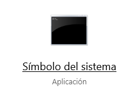

# Guía de instalación 

## Instalar Anaconda 3
- Seguir la guía en el siguiente enlace
- [Instalación de Anaconda](https://docs.anaconda.com/anaconda/install/)

## Correr Notebooks de Jupyter
### Windows
1. Buscar la aplicación de Símbolo del Sistema, escribiendo "cmd" en el buscador de programas.


1. Una vez la pantalla de Anaconda Prompt esté abierta, puede navegar a la carpeta donde se encuentra el notebook que quiere correr. En mi caso voy a ir a la carpeta llamada "Curso de Python" en mi Escritorio con el comando, presionando Enter.
```
cd Desktop\Python
```


- Preguntas frecuentes

1. Una vez en la carpeta, puede correr Jupyter Lab con el comando:
```
jupyter lab
```
Una vez ejecutado este comando, se abrirá Jupyter Lab en su navegador predeterminado del sistema, en la dirección "http://localhost:8888/"

1. Una vez abierto Jupyter Lab, podemos crear un nuevo Notebook dando click al siguiente ícono:


Esto creará un nuevo cuaderno de Jupyter en nuestra carpeta actual. También podemos abrir cuadernos existentes o abrir una nueva consola para ejecutar comandos.

1. Los notebooks que se vayan creando aparecen en el lado izquierda de la pantalla.


1. Para crear un nuevo bloque de código debe presionar el botón de "+" en la parte superior del Notebook.


1. Para ejecutar un bloque de código presionamos el botón de "Ejecutar celda y avanzar". También podemos utilizar el atajo de las teclas "Shift + Enter" para ejecutar y avanzar.


